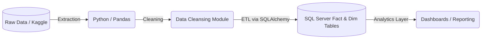
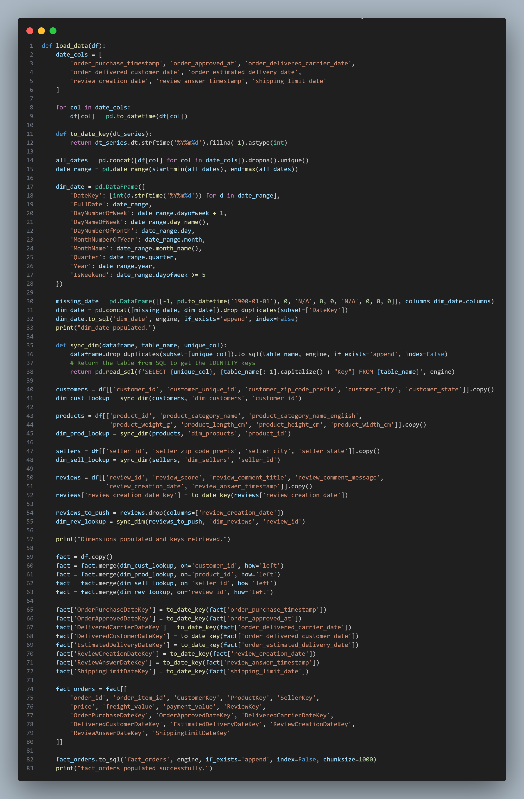

<div align="center">

# 🛒 E-Commerce Data Engineering Pipeline

*A robust automated ETL pipeline for E-Commerce analytics using Python, SQL Server, and Pandas.*


</div>

## 🏗 Architecture

The data pipeline follows a structured modular architecture to extract, transform, and load the E-Commerce records into an analytics-ready dimensional model.



## 📖 Project Overview

This repository contains an end-to-end Data Engineering solution focused on an E-Commerce dataset. The objective is to systematically extract raw transactional and customer data, thoroughly clean and standardize it, and load it into a properly modeled SQL Server Data Warehouse representing a Star Schema. 

By automating the ETL (Extract, Transform, Load) processes, this pipeline solves the business problem of fragmented and messy data. It transforms raw sources into a single, reliable source of truth, establishing a scalable foundation for business intelligence, reporting, and predictive analytics.

## 📂 Folder Structure

```text
E-Commerce/
├── DB SCHEMA/             # SQL scripts defining dim & fact tables, plus schema diagrams
├── Data Expl/             # Documentation explaining data columns and business logic
├── ETL/                   # Core ETL scripts mapping DataFrames to SQL
├── data/                  # Python scripts to fetch/collect raw data & datasets
├── data cleaning/         # Jupyter notebooks covering systematic data cleansing
├── docs/                  # Documentation assets (images, gifs)
├── README.md              # Project documentation
└── .gitignore             # Standardized git ignore rules
```

## 🛠 Tech Stack

- **Extraction & Transformation:** Python, Pandas, Numpy
- **Database Connection & ORM:** SQLAlchemy
- **Data Warehouse:** Microsoft SQL Server
- **Development Environment:** Jupyter Notebooks

## 🔄 Data Pipeline Flow

1. **Extraction (`data/`)**: Raw datasets are retrieved and stored locally for processing. Data collection logic gathers sources via APIs or raw CSV files.
2. **Exploration & Profiling (`Data Expl/`)**: Deep dive into the data structure. Includes evaluating dictionaries and performing preliminary exploration.
3. **Data Cleaning (`data cleaning/`)**: Handling missing values, standardizing columns, applying business logic, and deduplication prior to loading.
4. **ETL & Loading (`ETL/`)**: Connecting directly to Microsoft SQL Server using SQLAlchemy. Populating the dimensional tables (`dim_customers`, `dim_products`, `dim_sellers`, `dim_date`, `dim_reviews`) and the key fact table (`fact_orders`) into the analytical warehouse.

## 🖼 Screenshots

**Data Warehouse Schema Diagram:**  
*(Extracted from DB SCHEMA)*


**Pipeline Concept:**  
*(Placeholder - Add your own screenshot!)*  


**Analytics Dashboard:**  
*(Placeholder - Add your dashboard here!)*


## 🚀 How To Run

### Environment Requirements
- Python 3.8+
- Microsoft SQL Server
- ODBC Driver for SQL Server (Windows Authentication recommended)

### Setup Instructions

1. **Clone the repository:**
   ```bash
   git clone https://github.com/KhalidAbdelrazek/E-Commerce-Data-Pipeline.git
   cd E-Commerce-Data-Pipeline
   ```

2. **Create a virtual environment and install dependencies:**
   ```bash
   python -m venv venv
   source venv/bin/activate  # On Windows: venv\Scripts\activate
   pip install pandas numpy sqlalchemy jupyter kagglehub
   ```

3. **Initialize the Database Schema:**
   - Open SQL Server Management Studio (SSMS).
   - Create a new database named `E-Commerce` (or map to your existing database).
   - Execute the SQL script located at `DB SCHEMA/SQLQuery1.sql` to generate the dimensions and fact tables.

4. **Execute the Pipeline Sequence:**
   - Launch Jupyter Notebooks: `jupyter notebook`
   - Run the notebooks sequentially to emulate the pipeline:
     1. `data/collecting_data.ipynb`
     2. `data cleaning/cleansing.ipynb`
     3. `ETL/etl.ipynb`

<!-- ## 🔮 Future Improvements

- [ ] Implement Apache Airflow or Prefect to schedule and orchestrate the ETL execution.
- [ ] Transition from processing locally to utilizing PySpark for larger-scale distributed transformations.
- [ ] Store intermediate tables as Parquet or Delta formats instead of raw CSV.
- [ ] Implement data quality testing assertions (e.g. Great Expectations).

## 👨‍💻 Author

Built with ❤️ for Data Engineering.  
Feel free to reach out, suggest improvements, or open a pull request! -->
